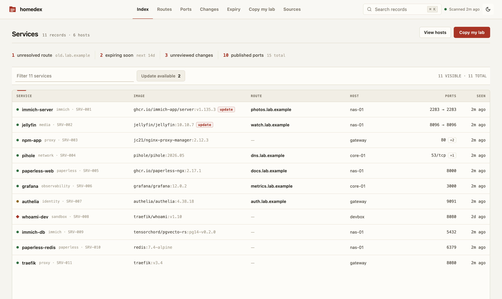
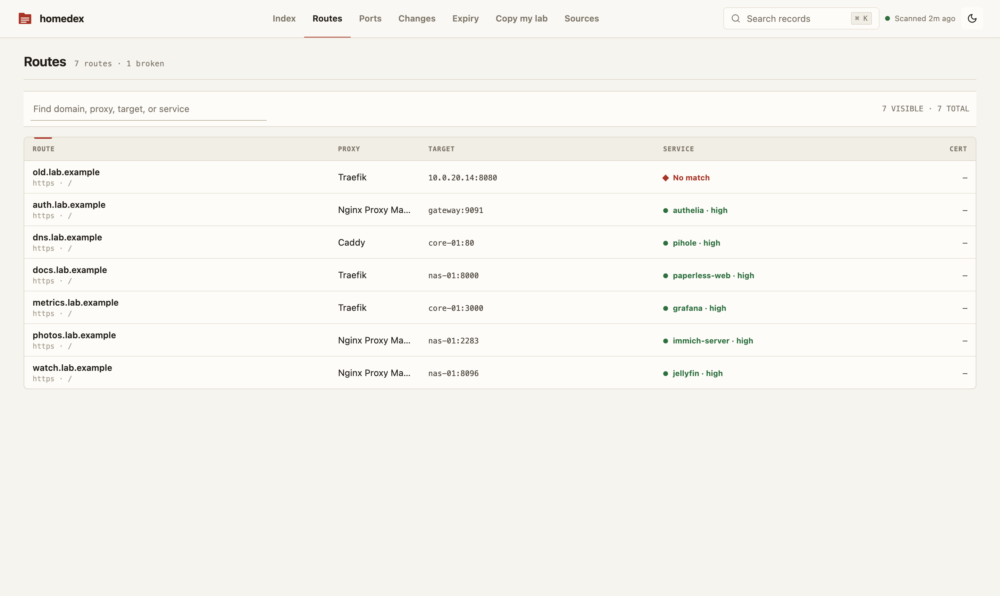
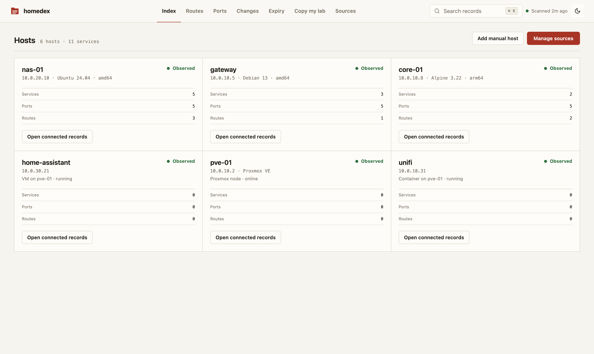
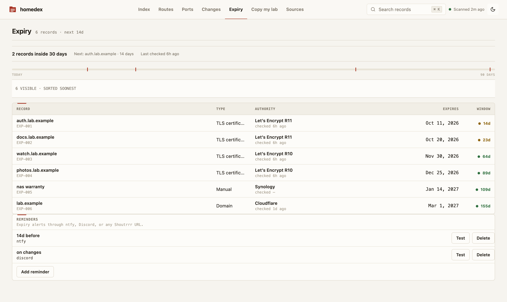
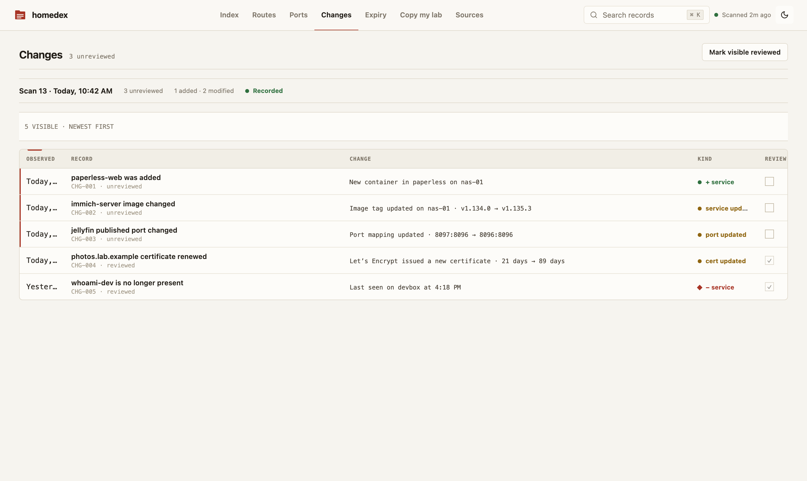

<div align="center">

# Homedex

**The missing inventory for your homelab.**

Point Homedex at Docker, Proxmox, Tailscale and your reverse proxy to build a searchable record of services, hosts, ports, routes, certificates, domains, and changes, and see which containers have a newer image.

**[Live demo](https://harshshah0203.github.io/homedex/)** (fabricated data, nothing to install) · [Quickstart](#quickstart) · [Write a connector](#write-a-connector)

[](https://github.com/HarshShah0203/homedex/actions/workflows/ci.yml)
[](LICENSE)

</div>

Homedex is **the ledger, not the map**: it answers “what runs where?” from observed infrastructure instead of asking you to maintain another spreadsheet. It does not start, stop, or reconfigure containers.

New connectors ship in tagged releases. To hear about them, choose **Watch > Custom > Releases** at the top of this page.



| Routes: domain → proxy → container, broken chains flagged | Hosts: Docker machines, Proxmox nodes, VMs and containers |
|---|---|
|  |  |
| **Expiry: certs and domains by days remaining** | **Changes: what moved between scans** |
|  |  |

> **Status:** the discovery engine, authenticated API, scheduled reconciliation, change feed, route resolution, TLS/RDAP connectors, exports, read-only shares, notifications, manual records/metadata, setup wizard, and embedded Svelte inventory UI are implemented and wired end to end.

## Quickstart

All you need is Docker with Compose v2. Download one file into a new directory and start it; there is nothing to clone or build:

```sh
mkdir homedex
cd homedex
curl -fsSLO https://raw.githubusercontent.com/HarshShah0203/homedex/main/docker-compose.yml
docker compose up -d
```

Use a new, empty directory. The download replaces any `docker-compose.yml` already there, and Compose also reads a `.env` or `docker-compose.override.yml` that sits next to it, which would change or take over the Homedex stack. Run later `docker compose` commands for Homedex from this directory too.

The stack pulls the published multi-arch image (`linux/amd64`, `linux/arm64`, `linux/arm/v7`), binds the UI to loopback, gives Homedex a persistent data volume, and puts a filtering proxy between Homedex and the Docker socket.

Open <http://127.0.0.1:7377>. The setup wizard creates your admin password, connects the first source (the compose stack's socket proxy at `tcp://docker-socket-proxy:2375` is prefilled), tests it read-only, and runs the first scan live. Your services, ports, and hosts appear in about a minute.

If `7377` is already occupied, set `HOMEDEX_PORT` when running Compose. The file follows the newest `0.2.x` image; set `HOMEDEX_VERSION` (for example `0.2.0`) to pin a release, and upgrade with `docker compose pull` followed by `docker compose up -d`.

The UI is reachable from this machine only. To open it from other machines on your LAN, set the admin password as you start it, so the setup page is never open to whoever reaches it first:

```sh
read -rs HOMEDEX_ADMIN_PASSWORD   # type a passphrase of 12 or more characters, then Enter
export HOMEDEX_ADMIN_PASSWORD
HOMEDEX_BIND=0.0.0.0 docker compose up -d
```

On first start Homedex stores only the password's Argon2id hash, logs that it was set from the environment (never the value), and the wizard then opens at sign-in and continues with your first source. An existing admin is never replaced, so later starts ignore the variable. **App-store installs** (Portainer templates and NAS app catalogs) publish the UI on the LAN straight away: fill in their admin password field. `HOMEDEX_ADMIN_PASSWORD_FILE` reads the password from a mounted secret file instead; see [deployment security](docs/SECURITY_DEPLOYMENT.md#setting-the-admin-password-at-startup). Without either, finish the setup wizard straight away after widening the bind.

Prefer automation? From a checkout, `scripts/add-connector.sh --setup docker "Local Docker" docs/examples/connectors/docker-socket-proxy.json` does the same over the API. See [the connector guide](docs/CONNECTORS.md) for Traefik, Caddy, Nginx Proxy Manager, nginx config files, SSH hosts, Tailscale, Proxmox VE, TLS, RDAP, image update checks, and remote Docker sources. Every one of them can also be added in the UI under **Sources**.

### Build from source

```sh
git clone https://github.com/HarshShah0203/homedex.git
cd homedex
docker compose -f docker-compose.yml -f docker-compose.build.yml up -d --build
```

The override builds the image from your checkout and keeps every hardening setting of the default file. [Build and test](#build-and-test) covers native builds.

### Why the socket proxy matters

`docker-compose.yml` gives the raw socket only to `docker-socket-proxy` and sets `POST=0`, which rejects mutating Docker API methods. Homedex talks to that proxy over an internal network.

A bind such as `/var/run/docker.sock:/var/run/docker.sock:ro` **is not, by itself, a Docker API security boundary**. The mount flag prevents replacing the socket file; it does not make API requests through that socket read-only. Start with [the socket-proxy guide](docs/DOCKER_SOCKET_PROXY.md) before changing the default deployment.

## Deterministic fake lab

The demo is local, contains only fabricated `.example` data, and needs no Docker host or reverse proxy at runtime:

```sh
docker compose -f demo/compose.yml up -d --build
curl -fsS http://127.0.0.1:7377/api/health
# open http://127.0.0.1:7377
```

It seeds the real SQLite schema and API with 3 hosts, 12 services, 16 port allocations, 10 routes, 4 certificates, and 1 domain. Nine routes resolve through network aliases or a published host port; one intentionally broken route exercises the failure state. See [demo/README.md](demo/README.md) for reset and native-binary commands.

The hosted [live demo](https://harshshah0203.github.io/homedex/) is different: it runs the same UI entirely in your browser on its own fabricated inventory, with no server behind it, so anything that would write, test, or scan is turned off.

## Implemented

| Area | Current behavior |
|---|---|
| Docker | Discovers host facts, all containers, Compose metadata, image/tag/digest, state/health, ports, networks, aliases, and labels via Unix, TCP/TLS, or SSH endpoints; Podman works through its Docker-compatible API |
| Reverse proxies | Reads Traefik HTTP API, Caddy admin config, Nginx Proxy Manager proxy-host/certificate APIs, and plain nginx or SWAG config files from a read-only mount (server blocks, includes, `set` variables, upstream groups) |
| SSH hosts | Agentless collector for hosts without an exposed Docker API: container facts via `docker ps` over SSH exec, listening-port facts via `ss` on any Linux host, key-only auth with pinned host-key fingerprints |
| Tailscale | Read-only device list from the Tailscale API (OAuth client with `devices:core:read`, or an API access token): hostnames, tailnet IPs, MagicDNS names, OS, and last seen; routes to tailnet names resolve to the service on the same machine |
| Proxmox VE | Read-only API token (PVEAuditor): every node, QEMU VM and LXC container of a cluster or single node, keyed by VMID and shown on the node it runs on, with its power state and the IPs its guest agent or container reports, so routes to a guest's IP resolve to the service on it; templates are skipped, guest configs are never read, and a self-signed certificate is pinned by the fingerprint a failed test shows |
| Route resolution | Joins upstreams to container network IPs, names/aliases, or host-published ports; unresolved routes are marked broken |
| Expiry data | Probes explicit TLS targets and queries explicit registrable domains through RDAP connectors |
| Image updates | Opt-in daily check of the tags Docker-source containers run against their registries (Docker Hub, ghcr.io, lscr.io, quay.io, others via their token challenge) with anonymous, read-only manifest `HEAD` requests: badges and filters containers whose tag now points at a newer build, reports pinned and unknown images honestly, and files one change-feed entry per newly published digest |
| Inventory | Services, hosts, ports, routes, certificates, domains, connector status, scan history, and changes in SQLite |
| Search | FTS-backed API search plus the UI command palette |
| Scanning | Scan-on-create/update, manual scan API, and enabled-connector schedules (15 minutes by default) |
| Enrichment | Notes, tags, typed custom fields, manual hosts/services, and manual expiry records through authenticated APIs |
| Export | Deterministic Markdown, JSON, per-view CSV, and a 100 KiB context pack with tested label/domain/IP redaction |
| Sharing | Revocable, optionally expiring tokens restricted to read-only inventory/entity/export routes; private notes, fields, and labels are omitted |
| Notifications | Expiry and change rules delivered through configured Shoutrrr URLs, with deduplication and post-commit evaluation |
| Local security | Argon2id admin password, HttpOnly session cookie, CSRF checks, login throttling, secretbox-encrypted connector config |

Docker container environment variables are not represented in Homedex's snapshot model and are never read. Docker labels **are** inventory data and may contain sensitive values; audit labels before granting other people access to the Homedex UI or backups.

## Positioning

| Tool | Best at | Different from Homedex |
|---|---|---|
| NetBox | Intended-state IPAM/DCIM | Richer enterprise model, but generally maintained as source-of-truth data rather than this Docker/proxy discovery path |
| Scanopy | Discovered network topology and diagrams | A map; Homedex is a table-first service/port/route ledger |
| homepage / Homarr | Launching services | A dashboard; Homedex records discovered infrastructure and changes |
| Uptime Kuma / Beszel | Health and metrics | Monitoring; Homedex does not perform uptime monitoring |
| Portainer / Komodo / Dockge | Managing workloads | Management planes; Homedex deliberately has no container lifecycle actions |

These tools can be complementary. Homedex is not a topology visualizer, monitor, orchestrator, or general-purpose CMDB.

## Deployment facts

- One Go process, one HTTP port (`7377`), one SQLite database.
- The image declares a Docker health check: `/homedex healthcheck` asks the running server for `/api/health` on the port `HOMEDEX_LISTEN` names, because the image has no shell or curl. Orchestrators and app stores can call the same command.
- The container runs as distroless non-root with a read-only root filesystem; only `/data` is writable. Its minimal OpenSSH client supports `ssh://` Docker endpoints when a dedicated key and verified `known_hosts` directory are mounted read-only.
- Compose drops Linux capabilities, sets `no-new-privileges`, isolates the socket proxy, and binds the UI to `127.0.0.1`.
- There is no built-in TLS termination. Use a trusted reverse proxy and set `HOMEDEX_SECURE_COOKIES=true` for HTTPS deployments.
- There is no telemetry and Homedex never checks for its own updates. Outbound connections occur only for configured connectors, TLS targets, RDAP lookups, and, when an image update source is added, anonymous manifest lookups at the registries your containers' images come from.
- The image target is **under 30 MiB**, with a **40 MiB hard CI limit**.

Read [SECURITY.md](SECURITY.md), [backup and data handling](docs/BACKUP_AND_DATA.md), and [deployment security](docs/SECURITY_DEPLOYMENT.md) before exposing the UI beyond localhost.

## Write a connector

Every source is a Go package under `internal/connectors` that implements three methods:

```go
type Connector interface {
    Kind() string
    Validate(context.Context, Config) error
    Scan(context.Context, Config) (domain.Snapshot, error)
}
```

A connector returns a complete `Snapshot` of what it observed and never writes the database; the engine owns persistence, diffing, and route reconciliation. It only ever reads from the system it connects to. The smallest API connector, [`internal/connectors/caddy/caddy.go`](internal/connectors/caddy/caddy.go), is about 110 lines.

Work through the [connector checklist in CONTRIBUTING.md](CONTRIBUTING.md#connector-shape) before opening a pull request: stable natural keys, bounded requests, context cancellation, scrubbed fixtures, and tests for both success and malformed input. Issues labelled [good first issue](https://github.com/HarshShah0203/homedex/labels/good%20first%20issue) are a good place to start.

## Build and test

Requirements: Go 1.23+, Node.js 22+, and Docker with Compose v2.

```sh
make build       # builds the web app, syncs embedded assets, then builds Go
make check       # Go/frontend tests and security contract checks
make smoke       # startup budget and seeded API smoke tests
make image       # local distroless image
```

CI runs Go tests with the race detector, `go vet`, frontend checks/tests/build, production E2E against the seeded embedded UI/API, embedded-asset drift, dependency-advisory classification, mandatory export/share redaction tests, the no-environment-ingestion tripwire, fake-lab smoke, startup budget, Compose hardening assertions, container/OpenSSH smoke, binary size, and image size.

Tagged releases are configured through [GoReleaser](.goreleaser.yml) for Linux, macOS, and Windows archives plus checksums/SBOMs. The release workflow builds `linux/amd64`, `linux/arm64`, and `linux/arm/v7` images for GHCR. See [docs/RELEASING.md](docs/RELEASING.md); do not assume an image tag exists until a corresponding GitHub release is published.

## Documentation

- [Docker socket proxy](docs/DOCKER_SOCKET_PROXY.md)
- [Connector configuration](docs/CONNECTORS.md)
- [Backup, restore, and data ownership](docs/BACKUP_AND_DATA.md)
- [Frontend dependency security](docs/DEPENDENCY_SECURITY.md)
- [Deployment security](docs/SECURITY_DEPLOYMENT.md)
- [Architecture](docs/ARCHITECTURE.md)
- [Release process](docs/RELEASING.md)
- [Contributing](CONTRIBUTING.md)

## License

[MIT](LICENSE)
