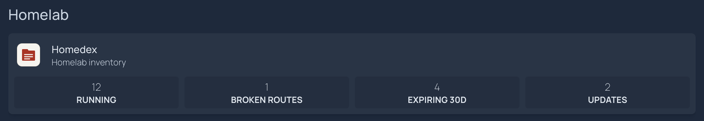

# Homedex on your dashboard

Homedex's summary API gives a dashboard the numbers worth a glance: services running, hosts, routes, broken routes, certificates and domains expiring within 30 days, available image updates, and unreviewed changes. Glance and Homepage can show them with their built-in generic widgets, so no plugin is needed.

```sh
curl -fsS -H "Authorization: Bearer $HOMEDEX_TOKEN" http://homedex:7377/api/summary
```

```json
{
  "services": {"running": 12, "total": 12},
  "hosts": {"total": 3},
  "routes": {"total": 10, "broken": 1, "resolved": 9},
  "expiry": {"total": 5, "due_within_30_days": 4},
  "updates": {"available": 2},
  "changes": {"unseen": 46}
}
```

The response also carries `ports` and a flat `counts` object. `updates.available` was added in v0.2.2; older versions omit it and the widgets below show 0.

## Create a token for the dashboard

1. In Homedex, open **Copy my lab** and create a **read-only share** named after the dashboard, for example `glance`.
2. Copy the share link. The token is everything after `/share/`. It is shown once; Homedex keeps only a hash.
3. Give the token to the dashboard as a secret or environment variable, never in a committed config file.

A share token is sent as `Authorization: Bearer <token>` (or `X-Homedex-Share: <token>`). It can read the inventory API and exports, never your notes, custom fields or labels, and every write is refused. It reads more than the summary, so treat it like a read-only password, and revoke it from the same panel if the dashboard is retired.

The dashboard needs to reach Homedex. If both run in Docker, put them on a shared network and use `http://homedex:7377`; the default Compose file binds Homedex to `127.0.0.1` on the host, which a container cannot reach through `localhost`.

## Glance


A `custom-api` widget. Set `HOMEDEX_URL` (no trailing slash) and `HOMEDEX_TOKEN` in Glance's environment.

```yaml
- type: custom-api
  title: Homedex
  title-url: ${HOMEDEX_URL}
  cache: 5m
  url: ${HOMEDEX_URL}/api/summary
  headers:
    Authorization: Bearer ${HOMEDEX_TOKEN}
    Accept: application/json
  template: |
    {{ $broken := .JSON.Int "routes.broken" }}
    {{ $expiring := .JSON.Int "expiry.due_within_30_days" }}
    {{ $updates := .JSON.Int "updates.available" }}
    <div style="display:grid;grid-template-columns:repeat(3,1fr);gap:1.5rem 1rem;text-align:center">
      <div>
        <div class="color-highlight size-h3">{{ .JSON.Int "services.running" }}<span class="color-subdue size-h5"> / {{ .JSON.Int "services.total" }}</span></div>
        <div class="size-h6">RUNNING</div>
      </div>
      <div>
        <div class="color-highlight size-h3">{{ .JSON.Int "hosts.total" }}</div>
        <div class="size-h6">HOSTS</div>
      </div>
      <div>
        <div class="color-highlight size-h3">{{ .JSON.Int "routes.total" }}</div>
        <div class="size-h6">ROUTES</div>
      </div>
      <div>
        <div class="size-h3 {{ if gt $broken 0 }}color-negative{{ else }}color-highlight{{ end }}">{{ $broken }}</div>
        <div class="size-h6">BROKEN ROUTES</div>
      </div>
      <div>
        <div class="size-h3 {{ if gt $expiring 0 }}color-negative{{ else }}color-highlight{{ end }}">{{ $expiring }}</div>
        <div class="size-h6">EXPIRING IN 30D</div>
      </div>
      <div>
        <div class="size-h3 {{ if gt $updates 0 }}color-primary{{ else }}color-highlight{{ end }}">{{ $updates }}</div>
        <div class="size-h6">UPDATES</div>
      </div>
    </div>
    {{ $unseen := .JSON.Int "changes.unseen" }}
    {{ if gt $unseen 0 }}
      <a class="size-h6 color-subdue" style="display:block;text-align:center;margin-top:1.5rem" href="${HOMEDEX_URL}/changes" target="_blank" rel="noreferrer">{{ $unseen }} UNREVIEWED CHANGES</a>
    {{ end }}
```

Broken routes and expiring items turn red when there are any, and the unreviewed-changes line links to the change feed. A wrong URL or token shows Glance's own error with the HTTP status, for example `401 Unauthorized`.

## Homepage



A `customapi` service widget. Add the token to Homepage's environment as `HOMEPAGE_VAR_HOMEDEX_TOKEN`.

```yaml
- Homelab:
    - Homedex:
        icon: https://raw.githubusercontent.com/HarshShah0203/homedex/main/docs/brand/homedex-icon-256.png
        href: https://homedex.example.lan
        description: Homelab inventory
        widget:
          type: customapi
          url: http://homedex:7377/api/summary
          refreshInterval: 300000
          headers:
            Authorization: Bearer {{HOMEPAGE_VAR_HOMEDEX_TOKEN}}
          mappings:
            - field: services.running
              label: Running
              format: number
            - field: routes.broken
              label: Broken routes
              format: number
            - field: expiry.due_within_30_days
              label: Expiring 30d
              format: number
            - field: updates.available
              label: Updates
              format: number
```

Swap any mapping for `hosts.total`, `routes.total` or `changes.unseen`. Homedex rescans every 15 minutes by default, so a refresh interval under a few minutes only adds load.

Both examples were checked against a seeded Homedex with Glance v0.8.6 and Homepage v2.4.0.
